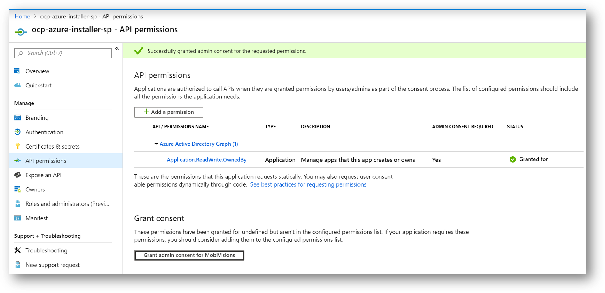

# Prerequisites

To use Red Hat OCP installer, you need to prepare in advance few prerequisites before starting the installation process.

This guide only focuses on the prerequisites that is shared between IPI and UPI methods.

## Installation parameters

>**NOTE:** If you are using existing resources like vnet, please make sure to update the values to the correct names and skip the creation steps

```bash

OCP_LOCATION=westeurope
OCP_LOCATION_CODE=euw
SUBSCRIPTION_CODE=mct
PREFIX=$SUBSCRIPTION_CODE-ocp-dev
RG_PUBLIC_DNS=$SUBSCRIPTION_CODE-dns-shared-rg
RG_VNET=$PREFIX-vnet-rg-$OCP_LOCATION_CODE
CLUSTER_NAME=dev-ocp-int-$OCP_LOCATION_CODE

DNS_ZONE=[subdomain].yourdomain.com

```

## Resource groups

### vNet resource group

Create a resource group to host the network resources (in this setup, we will use it for vnet)

>**NOTE:** If you have existing vnet, make sure that RG_VNET is set to its name and skip creation

```bash

az group create --name $RG_VNET --location $OCP_LOCATION

```

### Public DNS resource group

OPTIONAL: Create a resource group to host the public DNS (if you are using one)

```bash

az group create --name $RG_PUBLIC_DNS --location $OCP_LOCATION

```

>**NOTE:** For the cluster resource group, it will depend on your way of installation (IPI will create one, UPI you will create one later)

## (OPTIONAL) Public DNS Setup

```bash

# OPTION 1: Full delegation of a root domain to Azure DNS Zone
# Create a DNS Zone (for naked or subdomain)
az network dns zone create -g $RG_PUBLIC_DNS -n $DNS_ZONE

# Delegate the DNS Zone by updating the domain registrar Name Servers to point at Azure DNS Zone Name Servers
# Get the NS to be update in the domain registrar (you can create NS records for the naked-domain (@) or subdomain)
az network dns zone show -g $RG_PUBLIC_DNS -n $DNS_ZONE --query nameServers -o table

# Visit the registrar to update the NS records

# Check if the update successful
# It might take several mins for the DNS records to propagate
nslookup -type=SOA $DNS_ZONE

# Response like
# Server: ns1-04.azure-dns.com
# Address: 208.76.47.4

# yoursubdomain.yourdomain.com
# primary name server = ns1-04.azure-dns.com
# responsible mail addr = msnhst.microsoft.com
# serial = 1
# refresh = 900 (15 mins)
# retry = 300 (5 mins)
# expire = 604800 (7 days)
# default TTL = 300 (5 mins)

# Note: some proxies and routers might not prevent the nslookup. 
# Note: You need to make sure that you can get a valid response to nslookup before you proceed.

```

## Virtual network setup

If you have existing vnet, no need to create one, just update the below params with your network configs.

I will be creating the following cluster networking
- Address space: 10.165.0.0/23 (~500 addresses)
- Masters CIDR: 10.165.0.0/24 (~250 addresses)
- Workers CIDR: 10.165.1.0/24 (~250 addresses)

```bash

OCP_VNET_ADDRESS_SPACE="10.165.0.0/23"
OCP_VNET_NAME="spoke-${PREFIX}-${OCP_LOCATION_CODE}"
# Masters subnet (master VMs, ILB, IPI VMs)
MST_SUBNET_IP_PREFIX="10.165.0.0/24"
MST_SUBNET_NAME="mgm-subnet"
# Workers subnet
WRK_SUBNET_IP_PREFIX="10.165.1.0/24"
WRK_SUBNET_NAME="pods-subnet"

az network vnet create \
    --resource-group $RG_VNET \
    --name $OCP_VNET_NAME \
    --address-prefixes $OCP_VNET_ADDRESS_SPACE \
    --subnet-name $MST_SUBNET_NAME \
    --subnet-prefix $MST_SUBNET_IP_PREFIX

# Create subnet for services
az network vnet subnet create \
    --resource-group $RG_VNET \
    --vnet-name $OCP_VNET_NAME \
    --name $WRK_SUBNET_NAME \
    --address-prefix $WRK_SUBNET_IP_PREFIX

# Creating also Network Security Groups
MST_SUBNET_NSG_NAME=$MST_SUBNET_NAME-nsg
az network nsg create \
    --name $MST_SUBNET_NSG_NAME \
    --resource-group $RG_VNET

az network nsg rule create \
    --resource-group $RG_VNET \
    --nsg-name $MST_SUBNET_NSG_NAME \
    --name "apiserver_in" \
    --priority 101 \
    --access Allow \
    --protocol Tcp \
    --direction Inbound \
    --source-address-prefixes $WRK_SUBNET_IP_PREFIX \
    --source-port-ranges '*' \
    --destination-port-ranges 6443 \
    --destination-address-prefixes '*' \
    --description "Allow API Server inbound connection (from workers)"

# If you will use the installer-jumpbox VM, you can create a separate subnet for it
# It will allow you to delete it (or disable it via Network Security Groups after the cluster provisions)
INST_SUBNET_NAME="inst-subnet"
INST_SUBNET_IP_PREFIX="10.165.2.0/24"
az network vnet subnet create \
    --resource-group $RG_VNET \
    --vnet-name $OCP_VNET_NAME \
    --name $INST_SUBNET_NAME \
    --address-prefix $INST_SUBNET_IP_PREFIX

```

## Service principal setup

>**NOTE:** Usually this step requires the cooperation of AAD/Azure administrators. Reach out with these scripts to get them provisioned.

### Creating the SPN

Create a SP to be used by OpenShift (no permissions is granted here, it will be granted in the next steps)

```bash

OCP_SP=$(az ad sp create-for-rbac -n "${PREFIX}-installer-sp" --skip-assignment)

# As the json result stored in OCP_SP, we use some jq Kung Fu to extract the values 
# jq documentation: (https://shapeshed.com/jq-json/#how-to-pretty-print-json)
echo $OCP_SP | jq
OCP_SP_ID=$(echo $OCP_SP | jq -r .appId)
OCP_SP_PASSWORD=$(echo $OCP_SP | jq -r .password)
OCP_SP_TENANT=$(echo $OCP_SP | jq -r .tenant)
OCP_SP_SUBSCRIPTION_ID=$OCP_SUBSCRIPTION_ID
echo $OCP_SP_ID
echo $OCP_SP_PASSWORD
echo $OCP_SP_TENANT
echo $OCP_SP_SUBSCRIPTION_ID
# Save the above information in a secure location

```

### SPN permissions

#### Assigning AAD ReadWrite.OwnedBy

```bash

az ad app permission add --id $OCP_SP_ID --api 00000002-0000-0000-c000-000000000000 --api-permissions 824c81eb-e3f8-4ee6-8f6d-de7f50d565b7=Role

# Requesting the (Admin Consent) for the permission.
az ad app permission grant --id $OCP_SP_ID --api 00000002-0000-0000-c000-000000000000

```

Now by visiting the AAD in Azure portal, you can search for your service principal under "App Registrations" and make sure to grant the admin consent.

Checking on the AAD permission admin consent is granted successfully (if not, click on the Grant Admin Consent).



#### Assigning "Contributor" (for Azure resources creation) 

```bash

az role assignment create --assignee $OCP_SP_ID --role "Contributor"

```

#### Assigning "User Access Administrator" (to grant access to OCP provisioned components)

```bash

az role assignment create --assignee $OCP_SP_ID --role "User Access Administrator"

```

#### Have a look at SP Azure assignments

```bash

az role assignment list --assignee $OCP_SP_ID -o table

```

### Saving the SP credentials

OCP installer look for a file ```~/.azure/osServicePrincipal.json```.

We will save the SP details to that file so the OCP installer will pick the new one without prompting automatically.

```bash

echo $OCP_SP | jq --arg sub_id $OCP_SUBSCRIPTION_ID '{subscriptionId:$sub_id,clientId:.appId, clientSecret:.password,tenantId:.tenant}' > ~/.azure/osServicePrincipal.json

```

### Reset SPN credentials

If you wish to reset the credentials

```bash

az ad sp credential reset --name $OCP_SP_ID

```

### Recap

Notes: 
- OCP IPI installer rely on SP credentials stored in (~/.azure/osServicePrincipal.json). 
- If you run installer before on the current terminal, it will use the service principal from that location
- You can delete this file to instruct the installer to prompt for the SP credentials
